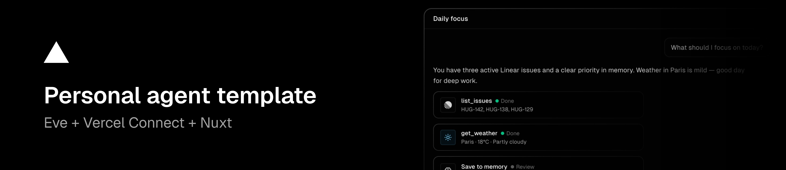

# Personal Agent Template

[](https://github.com/vercel-labs/personal-agent-template/actions/workflows/ci.yml)
[](https://github.com/vercel-labs/personal-agent-template/blob/main/LICENSE)
[](https://vercel.com)

**Template.** Fork it, customize it, and deploy your own personal agent.

[](https://vercel.com/new/clone?repository-url=https%3A%2F%2Fgithub.com%2Fvercel-labs%2Fpersonal-agent-template&env=BETTER_AUTH_SECRET,BETTER_AUTH_URL,INTERNAL_API_SECRET&envDescription=BETTER_AUTH_SECRET%3A%20run%20openssl%20rand%20-base64%2032%20%7C%20BETTER_AUTH_URL%3A%20your%20production%20URL%20%7C%20INTERNAL_API_SECRET%3A%20shared%20secret%20for%20web%20%2B%20eve&envLink=https%3A%2F%2Fgithub.com%2Fvercel-labs%2Fpersonal-agent-template%2Fblob%2Fmain%2Fdocs%2FENVIRONMENT.md&stores=%5B%7B%22type%22%3A%22integration%22%2C%22integrationSlug%22%3A%22tursocloud%22%2C%22productSlug%22%3A%22database%22%2C%22protocol%22%3A%22storage%22%7D%5D&project-name=personal-agent&repository-name=personal-agent)

Open source personal agent template. Web chat, Slack, iMessage, GitHub, Linear, and long-term memory — one codebase, durable sessions, user-approved memory saves.

## Features

### Web Chat — Threads That Persist

Chat with your agent in the browser. Threads resume across sessions, tool calls render in real time, and `save_memory` proposals require explicit approval before anything is stored.

### Slack — Same Agent, Different Surface

DMs and @mentions on Slack. Link your Slack account to your web profile so memory and context follow you across channels.

### iMessage — Text Your Agent

Reach V over iMessage via [Sendblue](https://chat-sdk.dev/adapters/vendor-official/sendblue). Add your phone number in **Profile**, then message the Sendblue line — same memory and context as web and Slack.

### GitHub — Repos, PRs, and CI

Connect GitHub via Vercel Connect. Ask about repositories, pull requests, issues, and workflows — the agent uses [@github-tools/sdk](https://github-tools.com/frameworks/eve) tools with durable approval on writes.

### Linear — Issues On Demand

Connect Linear via Vercel Connect MCP. Ask about issues, projects, and cycles — the agent queries Linear tools, never guesses from memory.

### Long-Term Memory — Import and Grow

Raycast-style import from ChatGPT or other assistants. Five fixed categories, one prose block each. Edit, delete, or let the agent propose updates via `save_memory`.

### Daily Summary — On Demand

Morning briefing skill: active focus from memory, assigned Linear issues, and a suggested next action. Trigger from the home quick action or ask in chat.

## [Architecture](./docs/ARCHITECTURE.md)

```
┌─────────────────────────────────────────────────────────────────┐
│              Web chat · Slack DMs / mentions · iMessage           │
└───────────────────────────────┬─────────────────────────────────┘
                                ▼
┌─────────────────────────────────────────────────────────────────┐
│              Eve agent (channels, tools, skills)                 │
└───────────────────────────────┬─────────────────────────────────┘
                                │ /api/internal/* (Bearer auth)
                                ▼
┌─────────────────────────────────────────────────────────────────┐
│         Nuxt (UI + Nitro API + Better Auth + SQLite)           │
└───────────────────────────────┬─────────────────────────────────┘
                                ▼
                      Vercel Connect (Linear, Slack)
```

On Vercel, two services deploy from [`vercel.json`](vercel.json): `web` (Nuxt) and `eve` (agent runtime).

## Quick Start

### Deploy to Vercel

[](https://vercel.com/new/clone?repository-url=https%3A%2F%2Fgithub.com%2Fvercel-labs%2Fpersonal-agent-template&env=BETTER_AUTH_SECRET,BETTER_AUTH_URL,INTERNAL_API_SECRET&envDescription=BETTER_AUTH_SECRET%3A%20run%20openssl%20rand%20-base64%2032%20%7C%20BETTER_AUTH_URL%3A%20your%20production%20URL%20%7C%20INTERNAL_API_SECRET%3A%20shared%20secret%20for%20web%20%2B%20eve&envLink=https%3A%2F%2Fgithub.com%2Fvercel-labs%2Fpersonal-agent-template%2Fblob%2Fmain%2Fdocs%2FENVIRONMENT.md&stores=%5B%7B%22type%22%3A%22integration%22%2C%22integrationSlug%22%3A%22tursocloud%22%2C%22productSlug%22%3A%22database%22%2C%22protocol%22%3A%22storage%22%7D%5D&project-name=personal-agent&repository-name=personal-agent)

### Self-hosting

**Requirements:** Node.js 24+, pnpm

```bash
git clone https://github.com/vercel-labs/personal-agent-template.git
cd personal-agent-template

pnpm install
cp .env.example .env
pnpm db:migrate
pnpm dev
```

Open [http://localhost:3000](http://localhost:3000), create an account, and start chatting.

**Required environment variables:**

```bash
BETTER_AUTH_SECRET=...       # openssl rand -base64 32
BETTER_AUTH_URL=http://localhost:3000
INTERNAL_API_SECRET=...      # openssl rand -base64 32 — same on web + eve
```

See [ENVIRONMENT.md](./docs/ENVIRONMENT.md) for the full reference.

Fresh local database:

```bash
rm -rf .data/db && pnpm db:migrate
```

## Customization

Personal Agent Template ships with **V** as the example persona. See the [Customization Guide](./docs/CUSTOMIZATION.md) for how to:

- Rename your agent (name, slug, persona)
- Change the AI model
- Add tools and skills
- Configure Slack, iMessage, and Linear integrations
- Theme the UI
- Deploy your fork

## Memory

Long-term memory is injected into every Eve session for authenticated users (web, linked Slack, and iMessage).

1. Open **Profile → Import Memory**
2. Copy the export prompt into ChatGPT, Claude, etc.
3. Paste the response → **Add to Memory**
4. Start a **new chat** so the agent picks up the latest context

V can also propose facts via **`save_memory`** — approve or skip in chat. Edit or delete entries on **Profile → Memory**.

## How It Works

> For the full technical deep-dive, see [Architecture](./docs/ARCHITECTURE.md).

1. **Auth**: Users sign in via Better Auth (email/password)
2. **Session start**: Eve fetches profile + memory and injects into agent instructions
3. **Chat**: Web UI streams through Eve; Slack events hit the slack channel; iMessage via Sendblue
4. **Tools**: Agent calls weather, save_memory, Linear MCP as needed
5. **Internal API**: Agent reads/writes memory, Slack links, and phone links via authenticated Nitro routes

## Development

```bash
pnpm dev          # Nuxt + Eve (eve/nuxt module — see Eve docs)
pnpm typecheck    # TypeScript check
pnpm build        # Production build
pnpm db:generate  # Generate Drizzle migrations
pnpm db:migrate   # Apply migrations
```

See [AGENTS.md](./AGENTS.md) for notes aimed at AI coding assistants.

## Built With

- [Eve](https://eve.dev) — Durable agent framework
- [Nuxt](https://nuxt.com) — Full-stack Vue framework
- [Nuxt UI](https://ui.nuxt.com) — UI component library
- [NuxtHub](https://hub.nuxt.com) — SQLite database
- [Better Auth](https://www.better-auth.com) — Authentication
- [Drizzle ORM](https://orm.drizzle.team) — Type-safe database queries
- [Vercel Connect](https://vercel.com/docs/connect) — Linear and Slack integrations

## Contributing

See [CONTRIBUTING.md](./CONTRIBUTING.md) for how to get involved.

## License

[MIT](./LICENSE)

# MarksLife First Response Agent（PoC）

> 複雑な不動産案件の初動対応を支援する社内AIアシスタント

---

# このPoCについて

本リポジトリは、マークスライフ株式会社の公開情報およびカジュアル面談を通して得られた内容をもとに作成したPoC（Proof of Concept）です。

実際の社内業務・データ・運用を再現したものではなく、

**「このようなAIアシスタントがあれば、事業拡大を支援できるのではないか」**

という仮説を検証することを目的としています。

---

# 背景

マークスライフでは、

- 空き家
- 相続
- 事故物件
- 再建築不可物件
- 共有持分

など、一般的な不動産会社では扱いにくい案件を数多く取り扱っています。

これらは

- 法律
- 税務
- 不動産
- 相続
- 人間関係
- 感情

など様々な要素が絡み合うため、

案件ごとに必要となる知識が大きく異なります。

さらに、今後さらに事業・組織が拡大すると、

- 初回対応品質
- ナレッジ共有
- 属人化
- 教育コスト

が課題になる可能性があると考えました。

---

# 解決したい課題

本PoCでは以下の課題を仮説として設定しています。

## 課題①

相談内容が複雑で、

**何から確認すればよいのか分からない**

---

## 課題②

過去に似た案件が存在していても、

**探すことが難しい**

---

## 課題③

経験者が誰なのか分からず、

**質問相手を探すだけで時間がかかる**

---

## 課題④

AIだけでは判断できない案件も多く、

**最終的には人へ相談する必要がある**

---

# PoCのコンセプト

AIで人を置き換えることではありません。

AIが

- 情報を整理し
- 類似事例を提示し
- 社内の知見へ素早くアクセスする

ことで、

**人がより良い判断をするための初動を支援する**

ことを目的としています。

---

# デモ

相談内容を入力すると、

- 案件の要約
- 確認事項
- 類似案件
- 社内の有識者
- 相談文の下書き

を生成します。

```
相談内容

↓

案件要約

↓

不足情報

↓

類似事例

↓

有識者候補

↓

相談文生成
```

---

# 主な機能

## 案件要約

自然言語から案件を構造化します。

---

## 初動確認事項

最初に確認すべき内容を整理します。

---

## 類似案件検索

ダミーデータから類似案件を提示します。

---

## 有識者推薦

案件内容から相談先候補を提示します。

---

## 相談文生成

相談依頼文を生成します。

---

# 技術構成

- Next.js
- TypeScript
- Vercel AI SDK
- Personal Agent Template
- Eve
- OpenAI
- Tailwind CSS

---

# システム構成

```
ユーザー

↓

AI Agent

├── 案件整理

├── 類似案件検索

├── 有識者検索

└── 回答生成

↓

ユーザー
```

---

# 今回実装しないもの

PoCであるため、以下は対象外です。

- kintone連携
- Slack連携
- メール送信
- 認証
- 本番データ
- 個人情報
- 権限管理
- ワークフロー
- RAG

---

# 今後の展望

将来的には

- kintone
- 社内ナレッジ
- 過去案件
- Slack

などと連携し、

AIだけではなく

**「AI + 人」**

によるナレッジ共有基盤へ発展させることを想定しています。

---

# 注意事項

本PoCは実在する顧客データ・社員データを一切使用していません。

すべてダミーデータで構成しています。

また、

AIは法的判断・契約判断・査定価格などを決定するものではなく、

最終判断は必ず人が行う前提としています。
