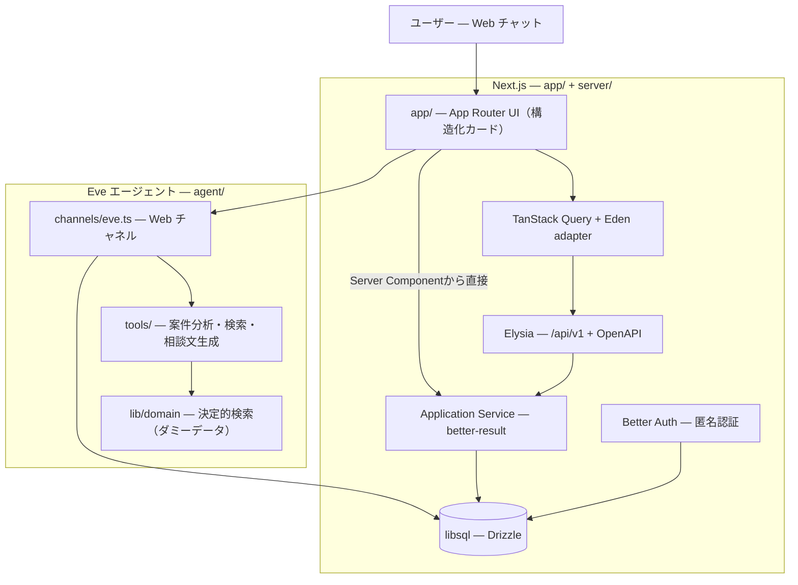

# アーキテクチャ

> [README](../README.md) に戻る | 参照: [環境変数](./ENVIRONMENT.md)

複雑不動産案件 初動支援アシスタント（PoC）の技術構成です。Next.js（App Router）+ Eve + Better Auth（匿名認証）による、Web チャット単一チャネルのエージェントです。

## システム概要



Vercel では [`next.config.ts`](../next.config.ts) の `withEve` により、Next.js と Eve エージェントランタイムを1つのプロジェクトとしてデプロイします。Eve のルートは同一オリジンの内部名前空間（既定 `/_eve_internal/eve`）にマウントされます（`vercel.json` は使用していません）。

## ディレクトリ構成

```
├── agent/                     # Eve エージェント
│   ├── agent.ts               # LLM モデル設定
│   ├── channels/eve.ts        # Web チャネル
│   ├── instructions.ts        # エージェント指示（英語）
│   ├── skills/                # initial-triage.md（初動トリアージ手順）
│   ├── tools/                 # analyze_case / search_similar_cases / search_experts /
│   │                          #   search_guides / draft_consultation_request ほか。
│   │                          #   bash, web_search 等の汎用ツールは disableTool() で無効化
│   └── lib/
│       ├── domain/            # 決定的検索: ダミーデータ + スコアリング（LLM 非依存）
│       ├── consultation-draft.ts
│       └── tool-schemas.ts    # ツール入出力の Zod スキーマ
├── app/                       # Next.js App Router
│   ├── page.tsx / chat/[id]/  # ランディング・チャット画面
│   ├── _components/           # eve-chat, tool-results（構造化カード）など
│   └── api/                   # auth/[...all], v1/[[...slugs]]（Elysia mount）
├── server/
│   ├── api/                   # Elysia Controller、OpenAPI、Zod HTTP契約
│   ├── application/           # 型付きResultを返すApplication Service
│   ├── db/                    # Drizzle スキーマ・マイグレーション・接続
│   ├── schemas/               # API 入出力の Zod スキーマ
│   └── utils/                 # auth, session, threads, Eve session失効
├── lib/                       # Eden/Better Auth client、sample-cases
├── shared/                    # 層間共有の型・ツール定義
└── tests/                     # Vitest（domain / agent / server）
```

パスエイリアス: `@/*` → リポジトリルート, `#lib/*` → `agent/lib/*`（`package.json` imports: `#*` → `agent/*`）。

## リクエストフロー

1. ユーザーが匿名サインイン（Better Auth anonymous プラグイン）
2. Client Componentのスレッド作成・更新・削除はTanStack Queryから `lib/api-client.ts` のEden adapterを呼び、Elysia `/api/v1` へ送る
3. Server ComponentはHTTP self-fetchを行わず、認証済みuser IDで同じApplication Serviceを直接呼ぶ
4. 相談内容を入力 — `app/_components/eve-chat.tsx` が Eve の Web チャネルへストリーム接続
5. エージェントが `analyze_case` → `search_similar_cases` / `search_experts` / `search_guides` → `draft_consultation_request` の順にツールを呼び出す
6. 各ツールは `agent/lib/domain/` の決定的検索で順位を確定する（LLM は結果の説明のみで、順位・採点を変更しない）
7. ツール結果は `app/_components/tool-results.tsx` の構造化カードとして描画される
8. スレッド更新はETag/`X-Thread-Revision`によるrevision競合検出を行い、libsqlへ永続化される

## API境界

Elysiaは `/api/v1/threads` と `/api/v1/threads/:id` を公開します。`server/api/` はBetter Auth認証、same-origin、Content-Type・body上限、`X-Thread-Revision`解析、HTTP status/header変換を担当します。`server/application/thread-service.ts` は認証済みuser ID、plain DTO、expected revisionを受け取り、repository interfaceだけへ依存して所有権付きDB処理を行います。想定内失敗は `better-result` のtyped errorとして合成し、HTTP境界で401・403・404・409・413・415・428・429・500へ変換します。

OpenAPI UIは `/api/v1/openapi`、JSON仕様は `/api/v1/openapi/json` です。`X-Thread-Revision`の必須性とETag response headerも機械可読な契約として公開します。ブラウザadapterは成功・エラーの両方をruntime検証し、TanStack Queryへplain値または `ThreadApiClientError` を返します。API errorの `retryable` をそのまま引き継ぎ、破損stateなどの恒久エラーを自動再試行しません。

## 型の正本

型の正本はデータの所有境界ごとに分けます。DB行とinsert型はDrizzle schema、未検証のHTTP・永続化JSON・ダミーJSON・Eveツール契約はZod、frameworkやSDKの契約は各公開型またはfactoryを正本とします。

- DB由来のID、revision、列型は `$inferSelect` / `$inferInsert`、indexed access、`Pick` / `Omit` から導出する
- Zod境界ではparse前を `z.input`、parse後を `z.output` とし、手書きDTOを別の正本にしない
- SDKとadapterの型は `Parameters` / `ReturnType` / `Awaited` から導出する
- DB行から公開DTOへ名前変更または直列化する値は、共通scalarだけを導出し、1か所のmapperで明示的に変換する
- 保存済みJSONの破損は欠損値へ変換せず、typed `Result` errorとしてApplication Serviceまで伝播する

AI実装向けの詳細規則は [`.agents/rules/typescript/type-source-of-truth.md`](../.agents/rules/typescript/type-source-of-truth.md)、利用者向けの規約は [`CODING_GUIDELINE.md`](../CODING_GUIDELINE.md)、プロダクト要件は [`REQUIREMENT.md` §13.3](../REQUIREMENT.md#133-型の正本) を参照します。

## データベース

libsql（ローカル: `file:.data/db.sqlite` / 本番: Turso）+ Drizzle ORM。スキーマは [`server/db/schema/`](../server/db/schema/)。

| テーブル | 用途 |
|----------|------|
| `user` / `session` / `account` / `verification` | Better Auth（匿名） |
| `threads` | チャットスレッド |
| `rateLimit` / `agent_rate_limits` | Better Auth・Eveの共有レート制限 |
| `agent_run_leases` | スレッド単位のEve同時実行制限（同一スレッド内は1件、別スレッドは並行可） |
| `eve_session_bindings` | Eveセッションと匿名user/threadの所有権・失効状態 |

マイグレーション: `pnpm db:generate` → `pnpm db:migrate`

## 認証

[Better Auth](https://www.better-auth.com) の匿名プラグインを使用します。設定は [`server/utils/create-auth.ts`](../server/utils/create-auth.ts)（実行時とテストで共通化）。

- 匿名セッションのみ（メール/パスワードは開発環境でのみ有効）
- セッション TTL は 24 時間
- 認証エンドポイントのレートリミット有効
- ユーザー削除時に関連スレッドを削除し、Eveセッションbindingを失効

## データ削除とEve保持

「デモデータを削除」はBetter Authの匿名user/sessionとTursoのthreadを削除し、`eve_session_bindings` を失効させて以後のstream/continueを拒否します。同時にpurge要求時刻を記録しますが、Eveランタイム内の実行セッション本体は別管理であり、本アプリから物理削除完了を保証できません。READMEとUIではこの制約を前提に、実在データを入力しないよう案内します。

## テスト

`tests/` 配下のVitestで、ドメイン検索の決定性、相談文生成、認証設定、Elysiaの公開HTTP契約、OpenAPI JSON、Eveの所有権・利用制限を検証します。

```bash
pnpm test
```

## Eve のドキュメント

チャネル・ツール・デプロイの詳細は `node_modules/eve/docs/` を参照してください。
