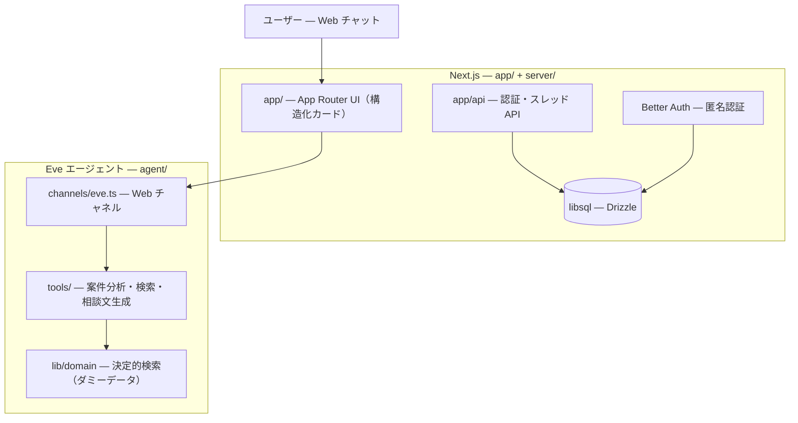

# アーキテクチャ

> [README](../README.md) に戻る | 参照: [環境変数](./ENVIRONMENT.md)

複雑不動産案件 初動支援アシスタント（PoC）の技術構成です。Next.js（App Router）+ Eve + Better Auth（匿名認証）による、Web チャット単一チャネルのエージェントです。

## システム概要



Vercel では [`vercel.json`](../vercel.json) の `experimentalServices` により `web`（Next.js）と `eve`（`/_eve_internal/eve`）の 2 サービスがデプロイされます。

## ディレクトリ構成

```
├── agent/                     # Eve エージェント
│   ├── agent.ts               # モデル設定（anthropic/claude-sonnet-4.6）
│   ├── channels/eve.ts        # Web チャネル
│   ├── instructions.ts        # エージェント指示（英語）
│   ├── skills/                # initial-triage.md（初動トリアージ手順）
│   ├── tools/                 # analyze_case / search_similar_cases / search_experts /
│   │                          #   search_guides / draft_consultation_request ほか。
│   │                          #   bash, web_search 等の汎用ツールは disableTool() で無効化
│   └── lib/
│       ├── domain/            # 決定的検索: ダミーデータ + スコアリング（LLM 非依存）
│       ├── consultation-draft.ts
│       └── tool-schemas.ts    # ツール入出力の Zod スキーマ
├── app/                       # Next.js App Router
│   ├── page.tsx / chat/[id]/  # ランディング・チャット画面
│   ├── _components/           # eve-chat, tool-results（構造化カード）など
│   └── api/                   # auth/[...all], threads, threads/[id]（route.ts）
├── server/
│   ├── db/                    # Drizzle スキーマ（auth, threads）・マイグレーション・接続
│   ├── schemas/               # API 入出力の Zod スキーマ
│   └── utils/                 # auth, create-auth, session, threads
├── lib/                       # auth-client, sample-cases（UI 用ダミー）
├── shared/                    # 層間共有の型・ツール定義
└── tests/                     # Vitest（domain / agent / server）
```

パスエイリアス: `@/*` → リポジトリルート, `#lib/*` → `agent/lib/*`（`package.json` imports: `#*` → `agent/*`）。

## リクエストフロー

1. ユーザーが匿名サインイン（Better Auth anonymous プラグイン）
2. 相談内容を入力 — `app/_components/eve-chat.tsx` が Eve の Web チャネルへストリーム接続
3. エージェントが `analyze_case` → `search_similar_cases` / `search_experts` / `search_guides` → `draft_consultation_request` の順にツールを呼び出す
4. 各ツールは `agent/lib/domain/` の決定的検索で順位を確定する（LLM は結果の説明のみで、順位・採点を変更しない）
5. ツール結果は `app/_components/tool-results.tsx` の構造化カードとして描画される
6. スレッドは `app/api/threads` 経由で libsql に永続化される

## データベース

libsql（ローカル: `file:.data/db.sqlite` / 本番: Turso）+ Drizzle ORM。スキーマは [`server/db/schema/`](../server/db/schema/)。

| テーブル | 用途 |
|----------|------|
| `user` / `session` / `account` / `verification` | Better Auth（匿名） |
| `threads` | チャットスレッド |

マイグレーション: `pnpm db:generate` → `pnpm db:migrate`

## 認証

[Better Auth](https://www.better-auth.com) の匿名プラグインを使用します。設定は [`server/utils/create-auth.ts`](../server/utils/create-auth.ts)（実行時とテストで共通化）。

- 匿名セッションのみ（メール/パスワードは開発環境でのみ有効）
- セッション TTL は 24 時間
- レートリミット有効（メモリストレージ）
- ユーザー削除時に関連スレッドも削除（`databaseHooks`）

## テスト

`tests/` 配下の Vitest。ドメイン検索の決定性（同一入力 → 同一順位）、相談文生成、認証設定を検証します。

```bash
pnpm test
```

## Eve のドキュメント

チャネル・ツール・デプロイの詳細は `node_modules/eve/dist/docs/` を参照してください。
